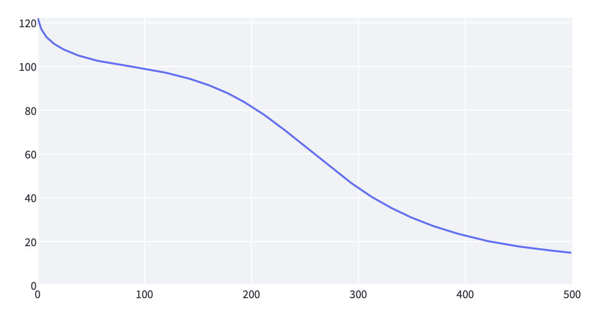
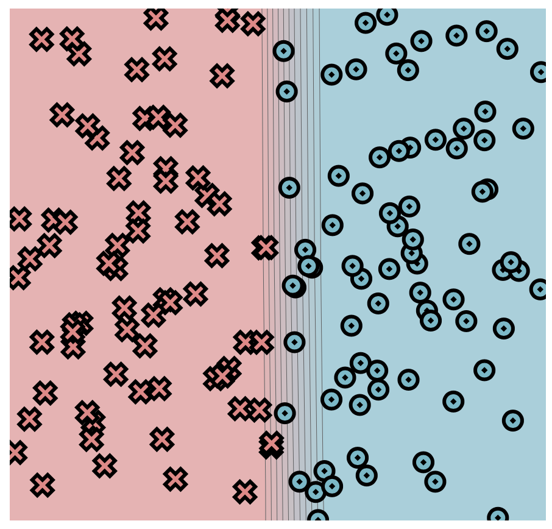
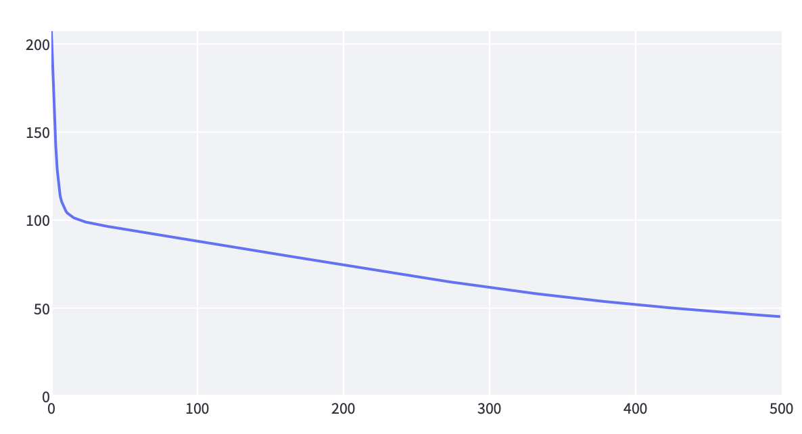
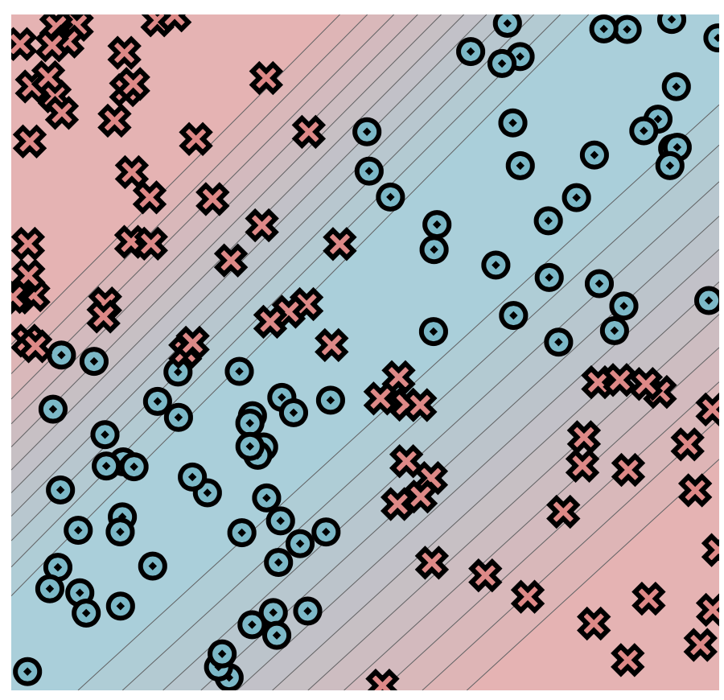
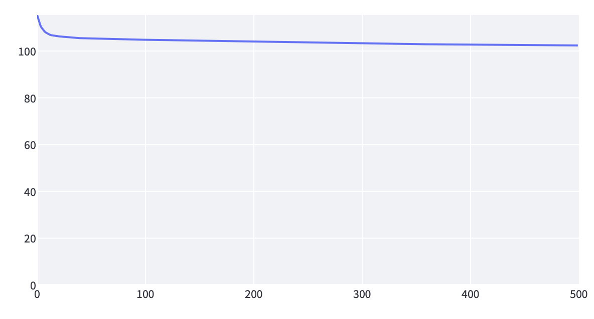
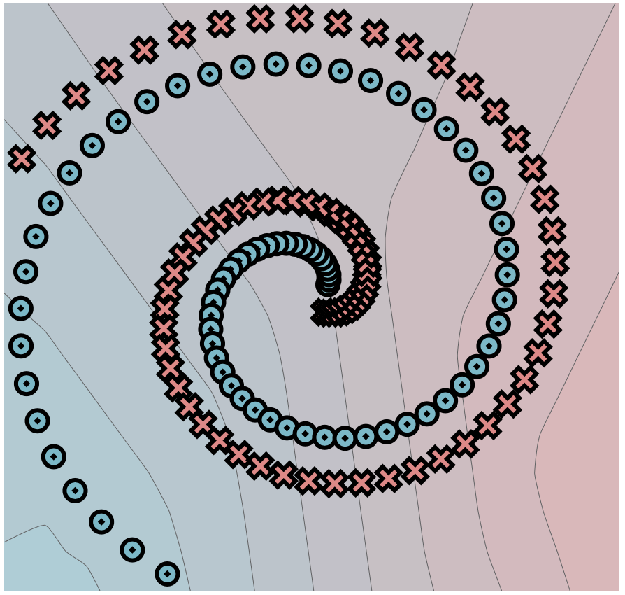
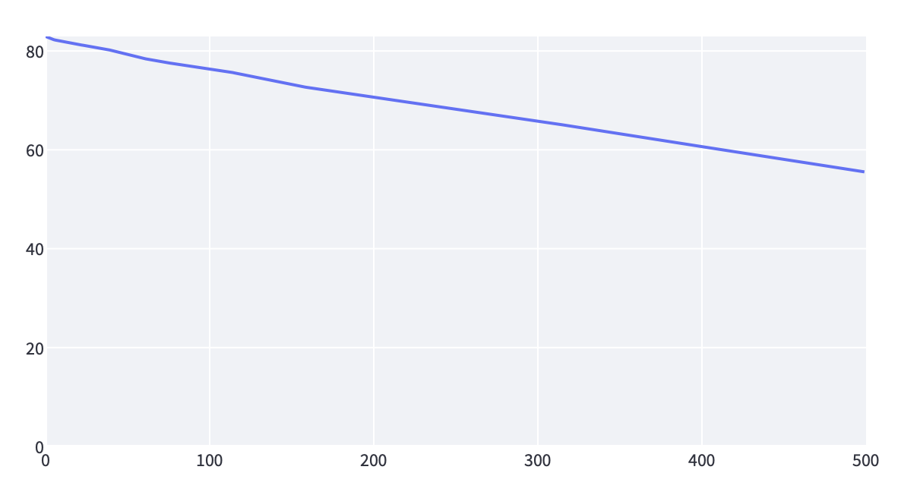
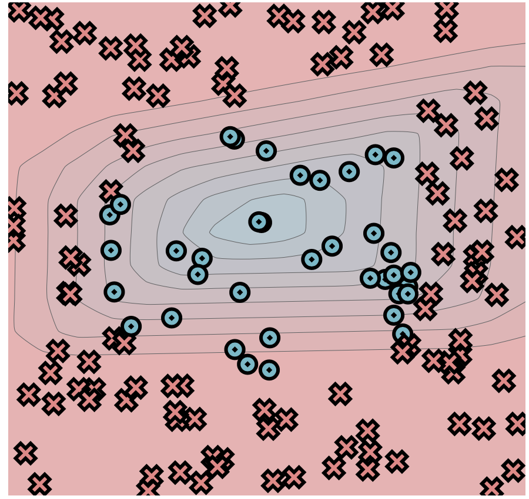

# MiniTorch Module 1


* Docs: https://minitorch.github.io/

* Overview: https://minitorch.github.io/module1/module1/

This assignment requires the following files from the previous assignments. You can get these by running

```bash
python sync_previous_module.py previous-module-dir current-module-dir
```

The files that will be synced are:

        minitorch/operators.py minitorch/module.py tests/test_module.py tests/test_operators.py project/run_manual.py

## Simple dataset

Last log
```
Epoch: 500/500, loss: 14.890488402542761, correct: 150
```



## XOR dataset
Last log
```
Epoch: 500/500, loss: 45.18039081721014, correct: 132
```



## Spiral dataset

Last log
```
Epoch: 500/500, loss: 102.38636243775998, correct: 87
```



## Circle dataset

Last log
```
Epoch: 500/500, loss: 55.53954372699599, correct: 122
```

